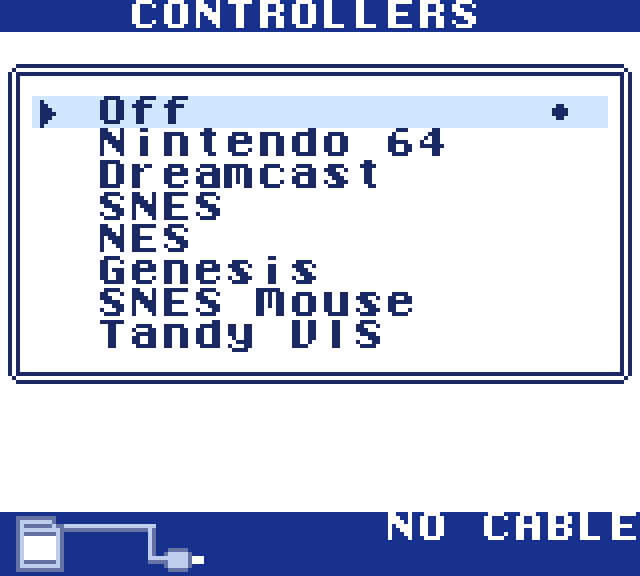
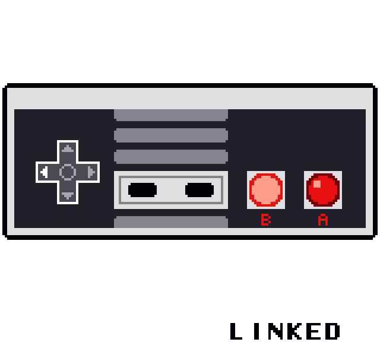
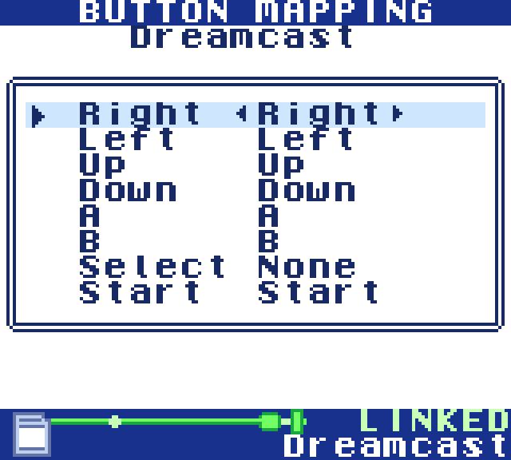
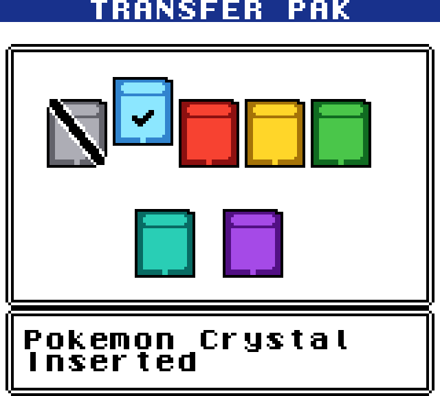
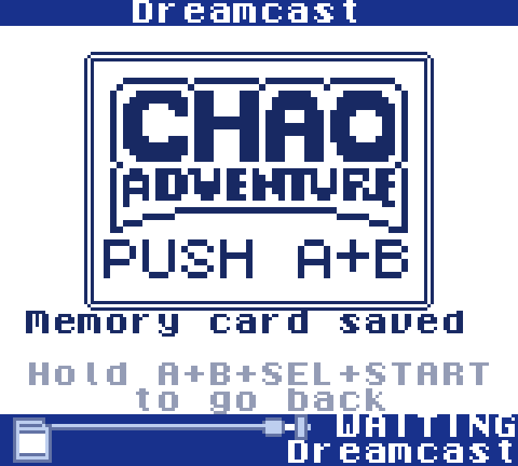

# (WIP) Universal Remote cartridge for Game Boy


A cartridge that lets you turn your Game Boy into many different things.
A game controller? A Bluetooth gamepad? A Bluetooth receiver? A tooth brush? Whatever your heart desires!

YouTube video: https://youtu.be/3ZZjWmHPqLs

Both the hardware and core GBC firmware is based on Shilga's Croco Cart:
- https://github.com/shilga/rp2350-gameboy-cartridge-firmware/
- https://github.com/shilga/rp-gameboy-cartridge-hw

## Building

Needs [GBDK-2020](https://github.com/gbdk-2020/gbdk-2020), the [Pico SDK](https://github.com/raspberrypi/pico-sdk) and Python 3.

```
python3 -m venv .venv && .venv/bin/pip install numpy
make -C rom GBDK_HOME=/path/to/gbdk
PICO_SDK_PATH=/path/to/pico-sdk cmake -S firmware -B firmware/build
cmake --build firmware/build
```

The first `make` builds the Game Boy ROM and embeds it in the firmware (`firmware/generated/rom.h`), so rebuild both after changing the ROM.

## Flashing

Hold the BOOTSEL button (`SW2`) while plugging the cartridge's micro-USB port into your computer, then either copy `firmware/build/gbc_controller.uf2` to the drive that appears or run:

```
picotool load -x firmware/build/gbc_controller.uf2
```

## Loading Game Boy ROMs for the Transfer Pak

The N64 driver can act as a Transfer Pak holding a Game Boy ROM stored in the cart's flash. Put the cart in BOOTSEL as above, then:

```
tools/slot.sh 1 game.gbc
```

Pick the game under Controllers → Nintendo 64 → Transfer Pak. Slots 1-6 hold up to 2 MB each and slot 7 up to 1.75 MB; loading one slot leaves the others alone. An optional third argument sets the name shown on the Game Boy.

## Screenshots

| Controller select | Gamepad | Button mapping |
|:---:|:---:|:---:|
|  |  |  |
| **N64 Transfer Pak** | **Dreamcast VMU** | |
|  |  | |


## FAQ

### What the hell is this?

It's a Game Boy cartridge with a bunch of stuff attached to it. USB, Bluetooth, WiFi, IR, even a generic 12-pin controller port via USB-C.

### Is this a flash cart?

Sort of. It can be used as a flash cart, although that isn't the intended purpose. It's more meant for turning a Game Boy Color into a multipurpose remote of sorts.
Plus the onboard flash is 16 MB, which is only enough for like 10 GBC games.

### Where are all those cool demos you showed in the video?

Most of them I probably won't publish since they involve modding existing commercial games, which is messy to maintain in a public repo.
However, original stuff like "Shellack!" will be published at some point when I get a chance to clean it up.

### Does this work on a regular Game Boy? What about Game Boy Advance?

- Regular Game Boy is a maybe. It doesn't physically fit, but you can cleverly bypass this using a Game Shark. However when I tried this myself it just sits on a blank screen. Haven't troubleshooted this problem.
- It does work on a Game Boy Advance

### Where do I buy this?

You can't, at least not directly. This repo contains the production files for the cartridge and adapter PCBs that you can send off to your favorite PCB manufacturing site, but I warn you it'll likely be very expensive (~$500+). Getting just two of these cartridges + 10 adapters made took a couple weeks and lots of back and forth with JLCPCB. Not to mention the tedium of wiring all those controller adapters. I wouldn't recommend it unless you have time and money to burn.

### Will you sell these at some point?

Maybe? Like every project of mine, this is really more of a novelty than something that's practically useful, so I don't see myself ordering hundreds of these and selling them on Ko-fi anytime soon. More likely a very limited run as some special merch or something.
